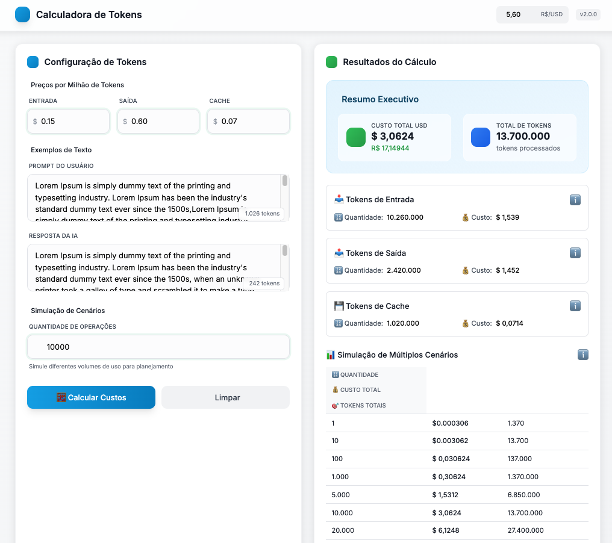

# 🧮 Calculadora de Tokens



Uma calculadora interativa para estimativa de custos de tokens de IA, desenvolvida com HTML, CSS e JavaScript puro usando Tailwind CSS.

## 📋 Funcionalidades

- ✅ Cálculo de custos baseado em tokens de entrada, saída e cache
- ✅ Simulação de múltiplos cenários com quantidade variável
- ✅ Interface responsiva e intuitiva
- ✅ Visualização detalhada de resultados
- ✅ Contagem automática de tokens em tempo real
- ✅ Validação de dados em tempo real
- ✅ Histórico de cálculos com localStorage
- ✅ Exportação de resultados (CSV)
- ✅ Atalhos de teclado
- ✅ Modo de impressão

## 🚀 Como Usar

### Instalação

1. Clone ou baixe este repositório
2. Abra o arquivo `src/index.html` em um navegador web moderno
3. Não é necessário servidor - funciona diretamente no navegador!

### Uso Básico

1. **Preencha os valores dos tokens:**

   - Valor do token de entrada (ex: $3.00 por 1M tokens)
   - Valor do token de saída (ex: $15.00 por 1M tokens)
   - Valor do token de cache (ex: $1.50 por 1M tokens)

2. **Adicione exemplos de texto:**

   - Texto de entrada: exemplo do que será enviado para a IA
   - Texto de saída: exemplo do que será retornado pela IA

3. **Defina a quantidade:**

   - Número de operações para simular

4. **Clique em "Calcular Custos"**

### Atalhos de Teclado

- `Ctrl/Cmd + Enter`: Calcular custos
- `Ctrl/Cmd + Shift + R`: Limpar formulário
- `Escape`: Focar no primeiro campo

## 🏗️ Estrutura do Projeto

```
calcula-tokens/
├── docs/
│   └── plano-implementacao.md
├── src/
│   ├── index.html           # Página principal
│   ├── css/
│   │   └── styles.css       # Estilos customizados
│   ├── js/
│   │   ├── main.js          # Script principal
│   │   ├── calculator.js    # Lógica de cálculo
│   │   └── utils.js         # Funções utilitárias
│   └── assets/
│       └── images/
├── tests/
└── README.md
```

## 🔧 Tecnologias Utilizadas

- **HTML5**: Estrutura semântica
- **CSS3**: Estilização customizada
- **Tailwind CSS**: Framework de utilitários CSS (via CDN)
- **JavaScript (ES6+)**: Lógica de aplicação
- **LocalStorage**: Persistência local de dados

## 📊 Como Funciona o Cálculo

### Estimativa de Tokens

A aplicação estima o número de tokens baseado em uma aproximação simples:

- **1 token ≈ 0.75 palavras**
- Conta palavras no texto e aplica o fator de conversão
- Tokens de cache são estimados como 10% dos tokens de entrada

### Cálculo de Custos

```javascript
// Conversão de preço por milhão para preço por token
preçoPorToken = preçoPorMilhão / 1.000.000

// Custo por tipo de token
custoEntrada = tokensEntrada × (preçoEntradaPorMilhão / 1.000.000)
custoSaída = tokensSaída × (preçoSaídaPorMilhão / 1.000.000)
custoCache = tokensCache × (preçoCachePorMilhão / 1.000.000)

// Custo total
custoTotal = (custoEntrada + custoSaída + custoCache) × quantidade
```

### Cenários de Simulação

A aplicação gera automaticamente cenários com diferentes quantidades:

- Múltiplos da quantidade base (0.5x, 2x, 5x, 10x, 50x, 100x)
- Quantidades fixas comuns (1, 10, 100, 1.000, 10.000)

## 🎨 Características da Interface

### Design Responsivo

- Layout adaptável para desktop, tablet e mobile
- Grid system flexível
- Componentes otimizados para touch

### Feedback Visual

- Validação em tempo real com cores
- Animações suaves para transições
- Estados de loading durante cálculos
- Mensagens de feedback contextuais

### Acessibilidade

- Labels semânticos
- Suporte a leitores de tela
- Navegação por teclado
- Contraste adequado

## 💾 Persistência de Dados

A aplicação salva automaticamente:

- Dados do formulário (localStorage)
- Histórico de cálculos (até 50 itens)
- Preferências do usuário

## 📤 Exportação de Dados

### Formatos Suportados

- **CSV**: Para análise em planilhas
- **JSON**: Para integração com outras ferramentas

### Dados Exportáveis

- Resumo executivo do cálculo
- Detalhamento por tipo de token
- Cenários de simulação
- Histórico completo

## 🧪 Validações Implementadas

### Preços de Tokens

- Valores entre $0.01 e $1000.00 por milhão de tokens
- Formato numérico válido
- Precisão de até 2 casas decimais

### Textos

- Campos obrigatórios não podem estar vazios
- Contagem automática de tokens
- Validação de caracteres especiais

### Quantidade

- Números inteiros positivos
- Faixa entre 1 e 1.000.000
- Validação em tempo real

## 🔍 Casos de Uso

### Desenvolvedores de IA

- Estimar custos de APIs de LLM
- Comparar diferentes modelos
- Planejar orçamentos de projetos

### Empresas

- Calcular ROI de implementações de IA
- Projetar custos operacionais
- Análise de viabilidade

### Pesquisadores

- Estimar custos de experimentos
- Comparar eficiência de prompts
- Análise de performance

## 🐛 Tratamento de Erros

### Validação de Entrada

- Verificação de tipos de dados
- Validação de faixas de valores
- Mensagens de erro contextuais

### Erros de Cálculo

- Verificação de divisão por zero
- Validação de resultados
- Fallbacks para valores inválidos

### Erros de Sistema

- Captura de erros JavaScript
- Logging para debug
- Mensagens amigáveis ao usuário

## 📱 Compatibilidade

### Navegadores Suportados

- Chrome 60+
- Firefox 55+
- Safari 12+
- Edge 79+

### Dispositivos

- Desktop (Windows, macOS, Linux)
- Tablets (iOS, Android)
- Smartphones (iOS, Android)

## 🔮 Roadmap Futuro

### Funcionalidades Planejadas

- [ ] Suporte a múltiplos modelos de IA
- [ ] Gráficos interativos
- [ ] Comparação de custos entre modelos
- [ ] API para integração
- [ ] Modo escuro
- [ ] PWA (Progressive Web App)

### Melhorias Técnicas

- [ ] Testes automatizados
- [ ] Otimização de performance
- [ ] Internacionalização (i18n)
- [ ] Acessibilidade avançada

## 🤝 Contribuição

Contribuições são bem-vindas! Para contribuir:

1. Fork o projeto
2. Crie uma branch para sua feature (`git checkout -b feature/AmazingFeature`)
3. Commit suas mudanças (`git commit -m 'Add some AmazingFeature'`)
4. Push para a branch (`git push origin feature/AmazingFeature`)
5. Abra um Pull Request

## 📄 Licença

Este projeto está sob a licença MIT. Veja o arquivo `LICENSE` para mais detalhes.

## 📞 Suporte

Para suporte ou dúvidas:

- Abra uma issue no GitHub

---

**Desenvolvido com ❤️ para a comunidade de IA**
